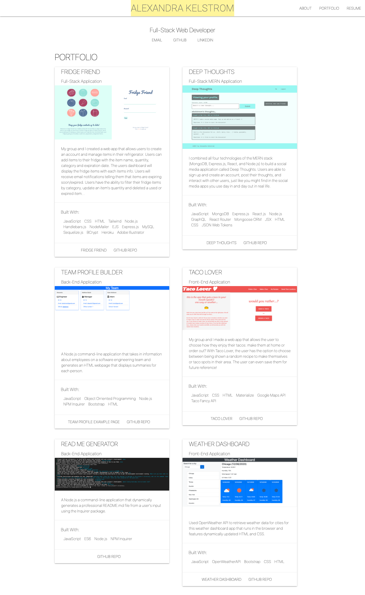

# Portfolio

## Description
Software Development Portfolio Website. My portfolio features six dynamic Web Development projects that includes Front-End, Back-End, and Full-Stack web applications. Two projects were completed with a team, while the rest were completed individually. 

## Usage
Visit my portfolio [here](https://akelstrom.github.io/portfolio-ak/)

## Built With
  * HTML
  * CSS
  * Responsive Web Design
  * Materialize
  * Feather Icons

## Credits
Big thanks to the Upenn LPS Coding Bootcamp instructional team for all their support!

## Questions
If you have any questions, feel free to contact me by email at [akelstrom@gmail.com](mailto:akelstrom@gmail.com).
